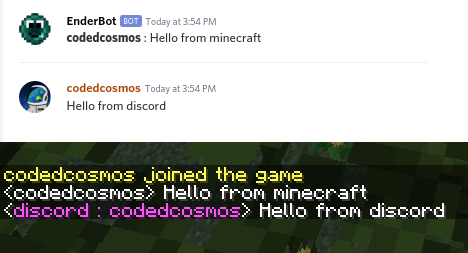
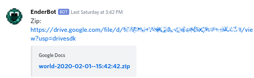

# EnderBot

### What is EnderBot?
Enderbot is both a minecraft plugin and a discord bot. It is designed to do 2 things.
1) Backup the world, upload to google drive and share the zip on discord
2) Reroute minecraft chat to discord and back for a specific channel

### Minecraft to Discord
Enderbot can reroute text from a specified discord channel to minecraft, and from minecraft chat back to that discord channel. Allowing people from the minecraft server and discord server to communicate.



### Zip Export
Every specified number of days Enderbot will automatically send a zip of the world file to the discord server making archival for server members automated and easy.



### Customisable config file
EnderBot also features a config file here is what the default file looks like:

```
# Ender Bot Configuration File
world-backups-channel-name=minecraft-backups
minecraft-ingame-channel-name=minecraft-in-game
world-backups-frequency-in-days=30

discord_bot_token=
```

world-backups-channel-name:
Set's the discord text channel that the zip message will be sent to.

minecraft-ingame-channel-name:
Set's where the ingame chat is rerouted to. Note any messages sent in this chat will also be routed to minecraft. Text in other channels is ignored. 

world-backups-channel-name can be set to the same text channel as minecraft-ingame-channel-name but this is not recommended since the zip message will likely be buried.

world-backups-frequency-in-days:
Set's how often in day's the zip backup will be created and shared.

discord_bot_token:
discord_bot_token is empty by default and will need to be manually set in order for Ender Bot to function. You can find this token at https://discordapp.com/developers/applications/

To find it, go to the link above, click on the bot of your choice, go to the Bot tab on the right, you may need to open the menu on the top right if you are on a mobile browser. There should be a area with the token. You can either click the copy button or press "Click to Reveal Token"

### Google drive Setup
You can find out how to get your own credentials.json and give permission to upload files to google drive here:
https://developers.google.com/drive/api/v3/quickstart/java

But also note on first startup with a correct config file. The bot will sent a link that will require manual authorisation. This is due to how google authenticates the google drive api. 


### Licensing
Note this code is released under GPL-v3
